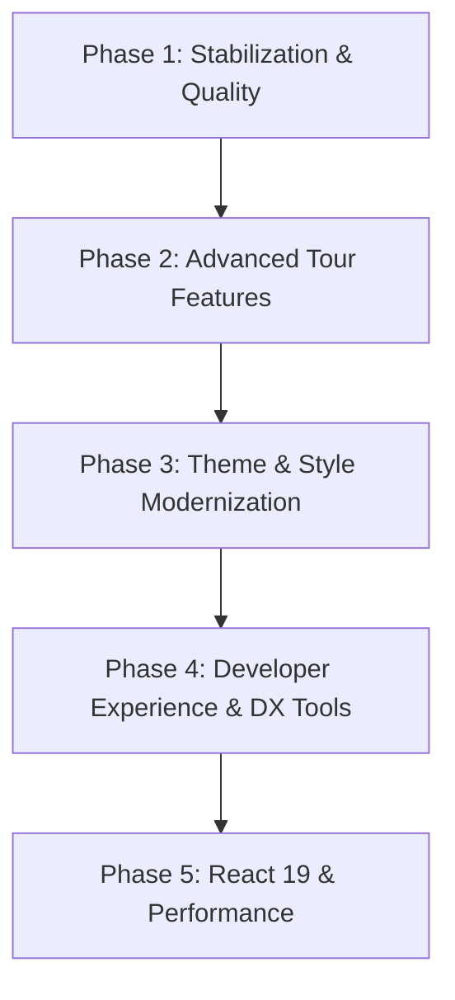

# GuideLoop Product Roadmap

This document outlines the short, medium, and long-term development goals, technical requirements, and architectural roadmap for the **GuideLoop** React guided tour library. The objective is to make GuideLoop the most flexible, performant, accessible, and developer-friendly guided tour library in the React ecosystem.

---

## 🗺️ Overview & Vision

GuideLoop's core vision is to provide a tour library that works out of the box with zero-configuration for complex web interfaces, while remaining highly customizable for developers.

---

## 📌 Phase 1: Stabilization and Test Coverage (Q3 2026)
*Goal: Increase codebase stability, minimize bugs, and drive test coverage above 90%.*

### 1.1 Unit & Component Test Expansion
- **Custom Hooks:** Write detailed unit tests for `useSteps`, `useSpotlight`, `useKeyboard`, `usePopper`, `useScroll`, and `useTheme`.
- **Component Integrity:** Ensure components like `Tooltip`, `MaskedOverlay`, `Spotlight`, and `Progress` render correctly under various combinations of props.
- **Robust Error Handling (Error Boundaries):** Ensure the library runs fallback behaviors without crashing when target elements are missing or invalid selectors are passed.

### 1.2 Integration and E2E Testing Infrastructure
- **Playwright / Cypress Integration:** Test step transitions, click triggers (`nextButtonClickElementId`, etc.), keyboard navigation (Esc, Arrow keys), and viewport resize behaviors in real browser environments.
- **Cross-Browser Testing:** Validate compatibility across Chrome, Firefox, Safari, and Edge.

### 1.3 Continuous Integration (CI/CD)
- **GitHub Actions:** Automatically run test suites, execute ESLint checks, and verify build outputs on every Pull Request and commit to the main branch.

---

## 📌 Phase 2: Advanced Tour Features (Q4 2026)
*Goal: Allow users to build more complex, dynamic, and flexible tours.*

### 2.1 Multi-Page (Multi-Route) Support
- **Scenario:** A user starts a tour on the `/dashboard` page, gets redirected to `/settings` to continue, and the tour resumes seamlessly from where they left off.
- **Solution:** An internal state manager that syncs tour progress (current step, active status) across route transitions via URL parameters or localStorage/sessionStorage.

### 2.2 Branching Tours & Conditional Steps
- Improve the `condition` logic and dynamic step resolution (e.g., jump to specific steps depending on user actions or conditions like "Is Admin?").
- Introduce status tracking for `beforeStep` and `afterStep` functions, enabling them to wait for async API calls or state updates before proceeding.

### 2.3 Advanced Event Triggers
- Allow advancing steps using event listeners on target elements (e.g., `onChange`, `onBlur`, `onHover`, `onDrag`) in addition to clicking the default "Next" button.
- Build a `MutationObserver`-based smart wait system that monitors the DOM and waits for target elements to load asynchronously.

---

## 📌 Phase 3: Theme System & Style Modernization (Q1 2027)
*Goal: Ensure GuideLoop components adapt to any design system or branding requirements.*

### 3.1 CSS Variables & CSS-in-JS Support
- Transition from inline-style configurations to a flexible CSS Custom Properties (CSS Variables) architecture.
- Enable direct styling overrides via global CSS class namespace hooks (`.guideloop-tooltip`, `.guideloop-spotlight`).

### 3.2 Tailwind CSS v4 and Modern Framework Integrations
- Guarantee full compatibility with Tailwind CSS v4 and enrich pre-built Tailwind theme configurations.
- Provide adapter presets for popular UI libraries like Shadcn UI, Chakra UI, and Mantine.

### 3.3 Advanced Masking and Spotlight Shapes
- Support custom SVG clipping masks for spotlight shapes (circles, ellipses, or custom polygons).
- Implement multi-spotlight capabilities to highlight multiple target elements simultaneously in a single step.

---

## 📌 Phase 4: Developer Experience & DX Tools (Q2 2027)
*Goal: Streamline the integration and debugging workflow for engineers.*

### 4.1 Visual Tour Builder
- Create a Storybook addon or a Chrome extension allowing developers to select DOM elements, arrange steps visually, and export the resulting GuideLoop JSON configuration array.

### 4.2 Interactive Debug HUD
- Provide a visual debug overlay in development mode (`process.env.NODE_ENV !== 'production'`) displaying step statistics, trigger histories, missing selectors, and performance metrics.

### 4.3 Examples Library
- Create a monorepo containing production-ready boilerplate examples for Next.js (App Router), Remix, Vite, and React Native Web.

---

## 📌 Phase 5: React 19 & Core Performance (Q3 2027)
*Goal: Align GuideLoop with future React standards and minimize its runtime footprint.*

### 5.1 React 19 Server Components Support
- Align with React 19 standards, optimizing `"use client"` boundaries and ensuring safe import trees for React Server Components (RSC).
- Update portal render logic and DOM manipulation hooks to align with React 19 hydration cycles.

### 5.2 Bundle Size & Tree Shaking Optimization
- Enable lazy-loading or dynamic imports for the core PopperJS dependencies.
- Reduce overall package size to under **5KB** (minified + gzipped).
- Eliminate non-essential external dependencies.

---

## 📊 Roadmap Tracking Matrix

| Feature / Goal | Priority | Complexity | Est. Effort | Status |
| :--- | :---: | :---: | :---: | :---: |
| **Unit Test Coverage (90%+)** | 🔴 Critical | Medium | 2 Weeks | Planned |
| **Playwright E2E Setup** | 🔴 Critical | Medium | 1 Week | Planned |
| **Multi-Route Support** | 🟡 High | High | 3 Weeks | Planned |
| **DOM Smart Wait (MutationObserver)** | 🟡 High | Medium | 2 Weeks | Planned |
| **CSS Variables Styling System** | 🟢 Medium | Low | 1 Week | Planned |
| **Visual Tour Builder** | 🟢 Low | Very High | 6 Weeks | Planned |
| **React 19 Compatibility** | 🟡 High | Medium | 2 Weeks | Planned |
