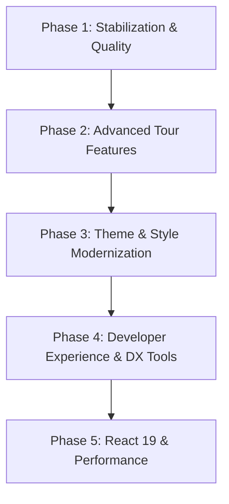

# GuideLoop Product Roadmap

This document outlines the short, medium, and long-term development goals, technical requirements, and architectural roadmap for the **GuideLoop** React guided tour library. The objective is to make GuideLoop the most flexible, performant, accessible, and developer-friendly guided tour library in the React ecosystem.

---

## 🗺️ Overview & Vision

GuideLoop's core vision is to provide a tour library that works out of the box with zero-configuration for complex web interfaces, while remaining highly customizable for developers.

```mermaid
graph TD
    A[Phase 1: Stabilization & Quality] --> B[Phase 2: Advanced Tour Features]
    B --> C[Phase 3: Theme & Style Modernization]
    C --> D[Phase 4: Developer Experience & DX Tools]
    D --> E[Phase 5: React 19 & Performance]
```

---

## 📌 Phase 1: Stabilization and Test Coverage ✅ Completed
*Goal: Increase codebase stability, minimize bugs, and drive test coverage above 90%.*

### 1.1 Unit & Component Test Expansion ✅
- **Custom Hooks:** Unit tests for `useSteps`, `useSpotlight`/`useSpotlights`, `useKeyboard`, `usePopper`, `useTheme`, `useElementClick`, `useElementTrigger`, `useWaitForTarget`, `useFocusTrap`, `useDebugLog`, etc.
- **Component Integrity:** `Tooltip`, `MaskedOverlay`, `Spotlight`, `Progress`, `Portal`, `DebugHUD`, `OnboardingChecklist`, `TourBuilder` suites.
- **Robust Error Handling (Error Boundaries):** ✅ `GuideLoopErrorBoundary` wraps `<GuideLoop>` — render failures call `onError` and render optional `fallback` (default `null`) so the host app never white-screens. Missing targets wait; invalid selectors warn without throwing.
- **Coverage gate:** Core library `collectCoverageFrom` enforces ≥90% lines (Tour Builder excluded as separate entry; still fully unit-tested).

### 1.2 Integration and E2E Testing Infrastructure ✅
- **Playwright:** Step transitions, triggers, keyboard nav, spotlight accuracy against the Next.js demo.
- **Cross-Browser Testing:** ✅ Chromium, Firefox, and WebKit projects in `playwright.config.ts`; CI installs all three.

### 1.3 Continuous Integration (CI/CD) ✅
- **GitHub Actions:** Lint, `tsc --noEmit`, Jest + coverage thresholds, multi-browser Playwright e2e, build, audit, Pages deploy, npm publish on release.

---

## 📌 Phase 2: Advanced Tour Features ✅ Completed
*Goal: Allow users to build more complex, dynamic, and flexible tours.*

### 2.1 Multi-Page (Multi-Route) Support ✅
- **Scenario:** A user starts a tour on the `/dashboard` page, gets redirected to `/settings` to continue, and the tour resumes seamlessly from where they left off.
- **Solution:** An internal state manager that syncs tour progress (current step, active status) across route transitions via localStorage or sessionStorage.
- **Implementation:** `src/utils/tourState.ts` with `saveTourState`, `loadTourState`, `clearTourState` + `persist` prop on `<GuideLoop>`.

### 2.2 Branching Tours & Conditional Steps ✅
- **`branch` function** on steps: return a step index to jump to dynamically (e.g., `branch: () => isAdmin ? 5 : 2`).
- **Step status tracking** (`'idle' | 'pending' | 'success' | 'error'`) for lifecycle hooks.
- **`afterStep`** now called in `useSteps` on step exit (both `nextStep` and `prevStep`).

### 2.3 Advanced Event Triggers ✅
- **`trigger` prop** on steps: `'click' | 'change' | 'blur' | 'hover' | 'drag'` — auto-advances when event fires on target element.
- **`waitForTarget` prop** on steps: `MutationObserver`-based DOM wait system for async-loaded elements.

### 2.4 Non-Linear Onboarding Checklists ✅
- **`OnboardingChecklist` component:** combines independent onboarding tasks in a persistent "Getting Started" card.
- **Action orchestration:** tasks can launch a GuideLoop tour, open an accessible modal, navigate to a link, or run custom async application logic.
- **Progress state:** supports controlled state or localStorage/sessionStorage persistence using stable item IDs.

---

## 📌 Phase 3: Theme System & Style Modernization ✅ Completed
*Goal: Ensure GuideLoop components adapt to any design system or branding requirements.*

### 3.1 Theme System with structuredClone Merge ✅ Completed
- All components consume `ThemeConfig` via the `useTheme` hook (tooltip, overlay, spotlight, buttons sections).
- `structuredClone`-based deep merge: `customTheme: Partial<ThemeConfig>` overrides the base theme.
- `hexToRgba` utility converts theme `overlay.background` + `overlay.opacity` into a single rgba string.

### 3.2 Tailwind Removal & Inline Styles ✅ Completed
- Removed all Tailwind CSS dependency (tailwind.config, postcss.config, CSS files).
- All styles are inline JS objects — no external CSS, no Tailwind utility classes.
- `guideloop-*` semantic class names remain for DOM identification only.

### 3.3 Built-in Theme Library ✅ Completed
- Three built-in themes: `tailwind`, `material`, `antd`.
- Theme lookup falls back to `tailwind` when `theme='custom'` is used.
- Theme types exported as part of the public API: `Theme`, `ThemeConfig`.

### 3.4 Advanced Masking and Spotlight Shapes ✅ Completed
- **`spotlightShape` on steps:** `'rect' | 'circle' | 'ellipse' | { type: 'polygon'; points }` — SVG mask cutouts via `resolveSpotlightShape`.
- **Multi-spotlight:** `additionalTargets` on steps highlights extra selectors in the same step (tooltip/triggers still use primary `target`).
- **Components:** `MaskedOverlay` and `Spotlight` accept `targets: SpotlightHole[]`; `useSpotlights` tracks multiple elements.

---

## 📌 Phase 4: Developer Experience & DX Tools (Q2 2027)
*Goal: Streamline the integration and debugging workflow for engineers.*

### 4.1 Visual Tour Builder ✅ Completed (MVP+)
- **In-app dev tool** — `import { TourBuilder } from 'guideloop/builder'`: floating **GL** button on your live local app, pick real DOM, edit/export/preview. Auto-hides unless `NODE_ENV === 'development'` (or `enabled`).
- **Standalone lab** at `examples/tour-builder` (port 3104) for offline practice.
- Shared capabilities: canvas/page pick (`elementsFromPoint`), selector validation, multi-spotlight extras, reorder, export JSON/TS, import, draft auto-save, preview with GuideLoop.
- Future stretch: Chrome extension packaging / Storybook addon.

### 4.2 Interactive Debug HUD ✅ Completed
- **`debug` prop** on `<GuideLoop>`: `true` | `false` | `'auto'` (default auto = `NODE_ENV === 'development'` only).
- Floating panel shows step index/title/status, time-on-step, target found/missing (incl. `additionalTargets`), trigger + waitForTarget, persist key, and a rolling event history (open/next/prev/skip/trigger/step-change/errors).
- Standalone `DebugHUD` export + `DebugSnapshot` types for custom tooling.

### 4.3 Examples Library ✅ Completed
- **`examples/`** standalone starters (local monorepo link via `guideloop: file:../..`):
  - `nextjs-app-router` — App Router client island + multi-page `persist`
  - `vite-react` — shapes, multi-spotlight, Debug HUD
  - `remix` — multi-route resume with Remix + Vite
  - `react-native-web` — DOM tour over RN-Web (`nativeID` targets)
- Documented run instructions in `examples/README.md` and root README.

---

## 📌 Phase 5: React 19 & Core Performance (Q3 2027)
*Goal: Align GuideLoop with future React standards and minimize its runtime footprint.*

### 5.1 React 19 Server Components Support ✅ Completed
- **`"use client"`** on all interactive components; preserved in published ESM/CJS via Rollup.
- **`guideloop/types`** RSC-safe entry (types + storage helpers only — no client components).
- **SSR-safe Portal** — mounts portal root after client effect (no `document` during RSC pre-render).
- **SSR-safe `useViewportSize`** / storage helpers / `isBrowser()` util.
- **Focus trap** retries until portal container exists (works with deferred portal + React 18/19).
- Peer range remains `react` / `react-dom` `>=16.8.0` (includes React 19).

### 5.2 Bundle Size & Tree Shaking Optimization ✅ Completed
- **`@popperjs/core` external** — no longer inlined into `dist` (saves ~7 kB gzip vs prior fat bundle).
- **Dynamic `import('@popperjs/core')` in `usePopper`** — consumer bundlers can async-chunk Popper.
- **ESM/CJS `preserveModules`** + `sideEffects: false` — unused exports (Onboarding, DebugHUD, …) tree-shakeable.
- **Compile target ES2019** (was ES5) — less downlevel bloat; removed unused PostCSS pipeline.
- **`npm run size`** reports raw/gzip per graph (full ESM ~18 kB gzip deps-external; GuideLoop chunk ~3 kB gzip).

---

## 📊 Roadmap Tracking Matrix

| Feature / Goal | Priority | Complexity | Est. Effort | Status |
| :--- | :---: | :---: | :---: | :---: |
| **Unit Test Coverage (90%+)** | 🔴 Critical | Medium | 2 Weeks | ✅ Done (core ≥90% lines; threshold enforced) |
| **Playwright E2E Setup** | 🔴 Critical | Medium | 1 Week | ✅ Done |
| **Error Boundaries (`onError` / `fallback`)** | 🔴 Critical | Low | 0.5 Week | ✅ Done |
| **Cross-Browser E2E (Chromium/Firefox/WebKit)** | 🔴 Critical | Medium | 1 Week | ✅ Done |
| **Multi-Route Support** | 🟡 High | High | 3 Weeks | ✅ Done |
| **Branching Tours** | 🟡 High | Medium | 2 Weeks | ✅ Done |
| **Advanced Event Triggers** | 🟡 High | Medium | 1 Week | ✅ Done |
| **DOM Smart Wait (MutationObserver)** | 🟡 High | Medium | 2 Weeks | ✅ Done |
| **Onboarding Checklists** | 🟡 High | Medium | 1 Week | ✅ Done |
| **Theme System (structuredClone Merge)** | 🟡 High | Medium | 2 Weeks | ✅ Done |
| **Tailwind Removal & Inline Styles** | 🟡 High | Medium | 1 Week | ✅ Done |
| **Built-in Theme Library** | 🟢 Medium | Low | 1 Week | ✅ Done |
| **Spotlight Shapes (rect/circle/ellipse/polygon)** | 🟡 High | Medium | 1 Week | ✅ Done |
| **Multi-Spotlight Targets** | 🟡 High | Medium | 1 Week | ✅ Done |
| **Interactive Debug HUD** | 🟡 High | Medium | 1 Week | ✅ Done |
| **Visual Tour Builder (MVP web tool)** | 🟢 Low | High | 6 Weeks | ✅ Done (MVP) |
| **Examples Library** | 🟢 Medium | Medium | 3 Weeks | ✅ Done |
| **Bundle / tree-shaking (Popper external)** | 🟡 High | Medium | 1 Week | ✅ Done |
| **React 19 / RSC support** | 🟡 High | Medium | 2 Weeks | ✅ Done |

---

## 🔭 Next (stretch / Phase 6 candidates)

Phases 1–5 are complete for the current roadmap. Natural follow-ups:

| Idea | Notes |
| :--- | :--- |
| **Storybook addon** | Phase 4.1 stretch — design/story-driven tour authoring |
| **Chrome extension packaging** | Phase 4.1 stretch — inject Tour Builder into any site |
| **OnboardingModal coverage** | Raise modal-specific branch coverage further |
| **Edge-only browser project** | Optional; Chromium project already covers Blink |
| **Accessibility audit** | axe/Playwright a11y checks on tooltip/dialog/checklist |
